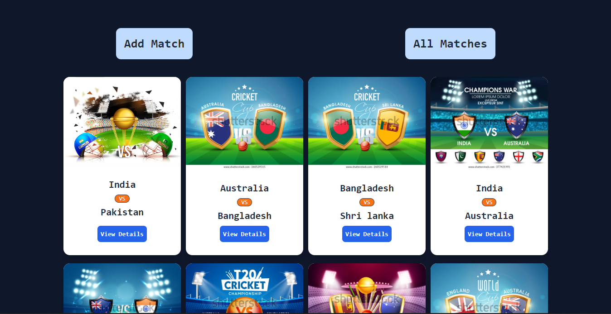
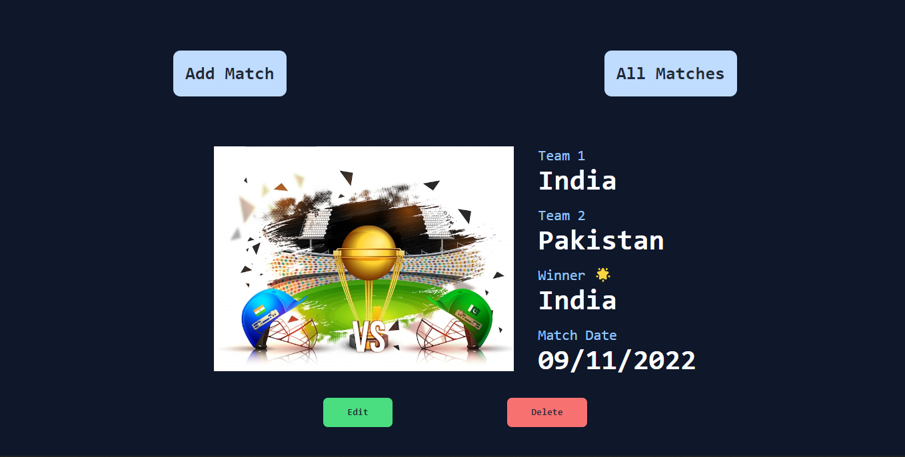
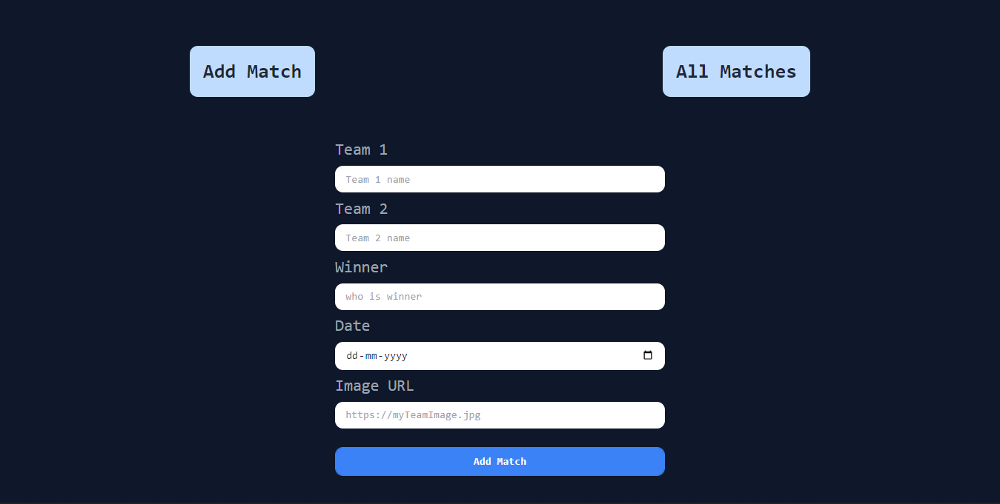

# `Live project link 🔗`

## [https://match-result-uttam1712.vercel.app/](https://match-result-uttam1712.vercel.app/)

# `Home page`

# `All Matches`

# `Match Details`

# `Form`

## Available Scripts

In the project directory, you can run:

### `yarn start`

Runs the app in the development mode.\
Open [http://localhost:3000](http://localhost:3000) to view it in your browser.

The page will reload when you make changes.\
You may also see any lint errors in the console.
